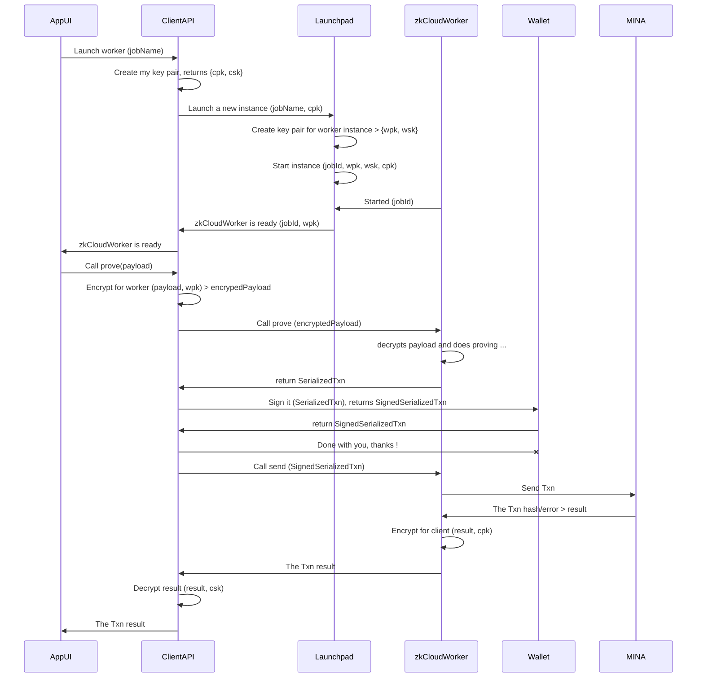

**App <> Worker event flow diagram**

**Components**:

- `App UI`

- `ClientAPI`

- `Launchpad`

- `zkCloudWorker`

- `Wallet`

**Encrypting communications**:

To preserve **privacy between the AppUI and the zkCloudWorker**, we use a set of "crossed" key pairs which are created exclusively for this particular client<>worker interaction, and will be destroyed when the worker has finished.

- On start of a new launch the ClientAPI will create a public/private key pair {cpk, csk} for itself .

- When connecting with the Launchpad the ClientAPI will send its own public key (cpk) to the Launchpad. 
- This client public key (cpk) will be used by the zkCloudWorker to encrypt its responses.
- When launching a new worker, the launchpad will also create a new  public/private key pair {wpk, wsk}. for the worker, and will return the worker public key (wpk) to the ClientAPI. 
- This worker public key (wpk) will be used by the ClientAPPI to encrypt the payloads sent to the worker.
- The zkCloudWorker can decrypt the payloads sent by the client using the worker secret key (wsk).
- The ClientAPI can decrypt the responses from the worker using its client secret key (csk).

As can bee seen, private keys are never exchanged and never leave its corresponding environment. 

Also the created used private keys are fully destroyed when the worker completes its work.

So we can consider this to be **a trusted but secure private exchange between the App (in the browser) and the worker (in the cloud)**.

**On private inputs**

Private inputs will effectively leave the browser, and though they may be encrypted, securely decrypting them in the contract itself is not feasible. Unless we use the worker private key, but this is not a great change, because using the worker private key means they can be decrypted before they reach the contract and so can be exposed inside the worker code.

The best countermeasure against this is to verify the cloud worker code. One aspect of it by forcing the worker code to be open-source and auditable. The second aspect is the ability to verify that the code that is being executed in the cloud worker, is exactly the same code existent in the particular open-source repository and commit. 

There is also a proposal using zkCloudWorker exactly attaching this issue: [Enhancing Transparency and Trust in zkApps with zkCloudWorker Contract Verification](https://zkignite.minaprotocol.com/zkignite/zkapp-cohort-3/feedbackandrefinement/suggestion/758)

**On Fully Homomorphic Encryption**

In certain particular cases it might be possible to use Partial Homomorphic Encryption, and there exists limited support for this in o1js (https://github.com/Trivo25/o1js-elgamal).

But currently there is no support for Full Homomorphic Encryption and using it in a general way to encrypt private inputs is not very feasible right now. This may change in the no so distant future.

**On serialized transactions**

Our idea is based on:

- To compile, create a new transaction and prove it on the cloud worker, we do not need the private key of the sender, we just need its public key.
- When the proving is done we can serialize the proved transaction to JSON and send it back to the App.
- The App can then use the Wallet to sign this serialized transaction, and send it again to the cloud worker already signed, so that the worker can dispatch it to MINA.
- As can be seen here the private key of the sender never leaves the browser preserving the private keys security.

IMPORTANT: due to a reported issue on o1js, it is currently not possible to sign a serialized transaction using the Wallet, but may be possible using the mina-signer. So, even if we are blocked by this now, we are confident we will find a solution to this issue with the help of O(1)Labs.

